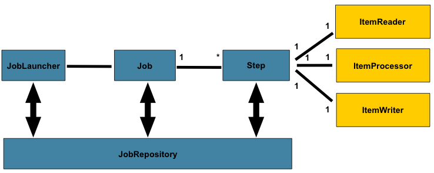

## Spring Batch 를 활용하여 Person Entity를 DB에 저장하고 조회하는 작업 수행 기능

---
# Spring Batch

- 대용량 데이터 처리 애플리케이션을 만들기 위한 프레임워크
- DB에서 데이터를 읽어와 처리 후, 다른 DB 또는 File로 쓰는 작업을 자동화
- CSV, XML, JSON 파일에서 사용자 정보를 읽어와 데이터베이스에 저장
- 외부 API를 호출하여 데이터를 가져옵니다.
- 데이터베이스 간의 데이터 이동


ex1) 
csv -> Person Entity 
```java
@Bean
public FlatFileItemReader<Person> reader() {
return new FlatFileItemReaderBuilder<Person>()
.name("personItemReader")
.resource(new ClassPathResource("data.csv"))
.delimited()
.names(new String[]{"firstName", "lastName"})
.fieldSetMapper(new BeanWrapperFieldSetMapper<Person>() {{
setTargetType(Person.class);
}})
.build();
}
```

ex2) 변환된 데이터 DB 저장
```java
@Bean
public JpaItemWriter<Person> writer(EntityManagerFactory entityManagerFactory) {
JpaItemWriter<Person> writer = new JpaItemWriter<>();
writer.setEntityManagerFactory(entityManagerFactory);
return writer;
}
```
---
# Spring Batch 기본 구성 요소

- JobReposiotry: JobLauncher, Job, Step 구현체에 CRUD 기능 제공
- JobLauncher: JobParameters로 Job을 실행하는 인터페이스
- Job: 하나 이상의 Step으로 구성된 배치 작업의 논리적 단위
- Step: 각 단계를 구성하는 구성 요소로, ItemReader, ItemProcessor, ItemWriter를 포함
- ItemReader: 데이터를 읽어오는 역할
- ItemProcessor: 읽어온 데이터를 처리(변환)하는 역할
- ItemWriter: 처리된 데이터를 저장하는 역할

---
# Spring Batch Table
- BATCH_JOB_INSTANCE
  - 배치 작업 인스턴스 저장
  - Column
    - JOB_INSTANCE_ID: 배치 작업 인스턴스의 고유 식별자
    - JOB_NAME: 배치 작업의 이름
    - JOB_KEY: 배치 작업의 키

- BATCH_JOB_EXECUTION
  - 배치 작업의 실행 정보를 저장
  - Column
    - JOB_EXECUTION_ID: 배치 작업 실행의 고유 식별자
    - JOB_INSTANCE_ID: 관련된 배치 작업 인스턴스의 ID
    - CREATE_TIME, START_TIME, END_TIME: 실행 시간 정보
    - STATUS, EXIT_CODE, EXIT_MESSAGE: 실행 상태와 종료 정보 

- BATCH_JOB_EXECUTION_PARAMS
  - 배치 작업 실행 시 사용된 파라미터를 저장
  - Column
    - JOB_EXECUTION_ID: 관련된 배치 작업 실행의 ID
    - PARAMETER_NAME: 파라미터 이름
    - PARAMETER_TYPE: 파라미터 타입
    - PARAMETER_VALUE: 파라미터 값

- BATCH_STEP_EXECUTION
  - 배치 작업 단계의 실행 정보를 저장
  - Column
    - STEP_EXECUTION_ID: 배치 작업 단계 실행의 고유 식별자
    - JOB_EXECUTION_ID: 관련된 배치 작업 실행의 ID
    - STEP_NAME: 단계 이름
    - CREATE_TIME, START_TIME, END_TIME: 실행 시간 정보
    - STATUS, EXIT_CODE, EXIT_MESSAGE: 실행 상태와 종료 정보

- BATCH_STEP_EXECUTION_CONTEXT
  - 배치 작업 단계 실행의 컨텍스트 정보를 저장
  - Column
    - STEP_EXECUTION_ID: 관련된 배치 작업 단계 실행의 ID
    - SHORT_CONTEXT: 짧은 컨텍스트 정보
    - SERIALIZED_CONTEXT: 직렬화된 컨텍스트 정보

- BATCH_JOB_EXECUTION_CONTEXT
  - 배치 작업 실행의 컨텍스트 정보를 저장
  - Column
    - JOB_EXECUTION_ID: 관련된 배치 작업 실행의 ID
    - SHORT_CONTEXT: 짧은 컨텍스트 정보
    - SERIALIZED_CONTEXT: 직렬화된 컨텍스트 정보

- BATCH_STEP_EXECUTION_SEQ
  - 배치 작업 단계 실행의 ID 생성을 위한 시퀀스 테이블
  - Column
    - ID: 시퀀스 값
    - UNIQUE_KEY: 고정된 유니크 키 값 ('0')

- BATCH_JOB_EXECUTION_SEQ
  - 배치 작업 실행의 ID 생성을 위한 시퀀스 테이블
  - Column
    - ID: 시퀀스 값
    - UNIQUE_KEY: 고정된 유니크 키 값 ('0')

- BATCH_JOB_SEQ
  - 역할: 배치 작업 인스턴스의 ID 생성을 위한 시퀀스 테이블
  - 주요 컬럼:
    - ID: 시퀀스 값
    - UNIQUE_KEY: 고정된 유니크 키 값 ('0')
---

Spring Batch : 5.1.2